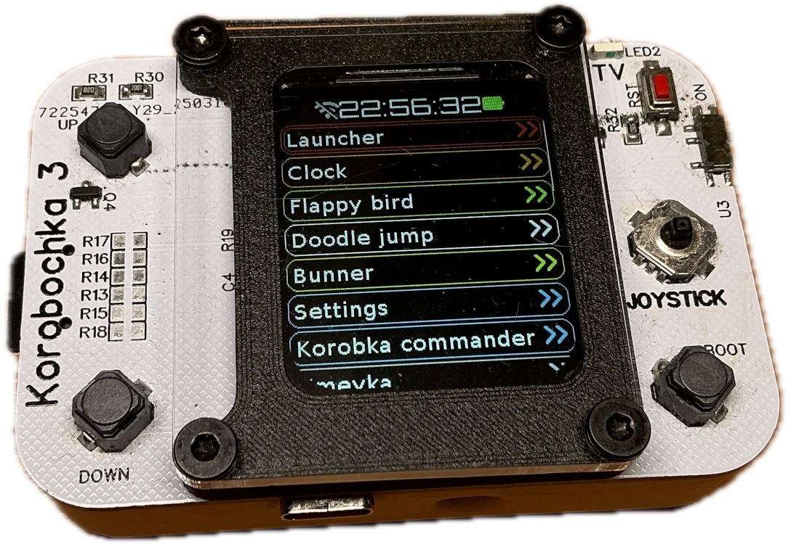
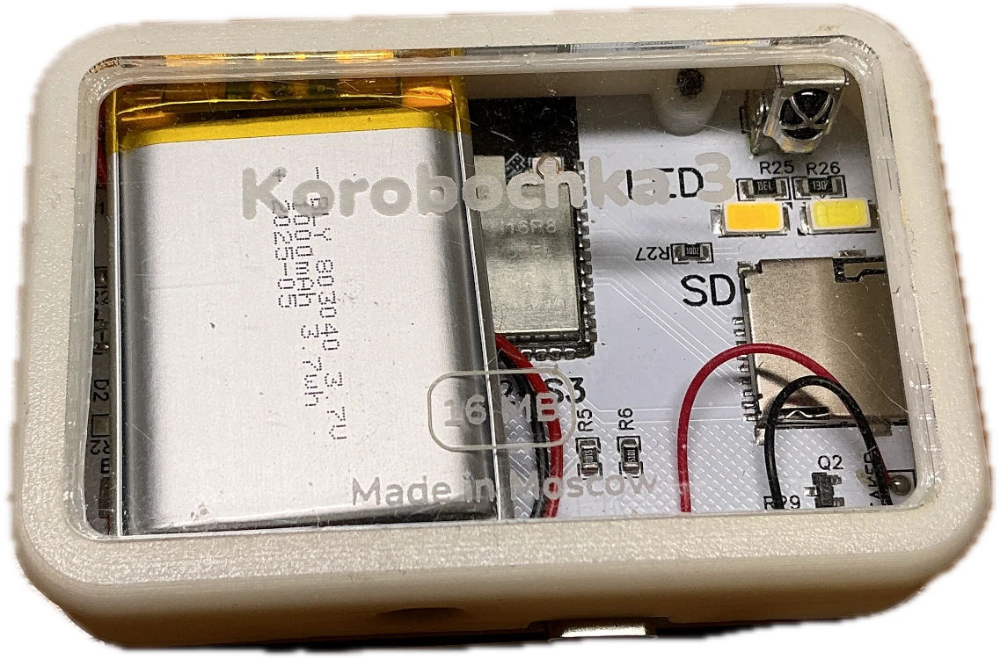
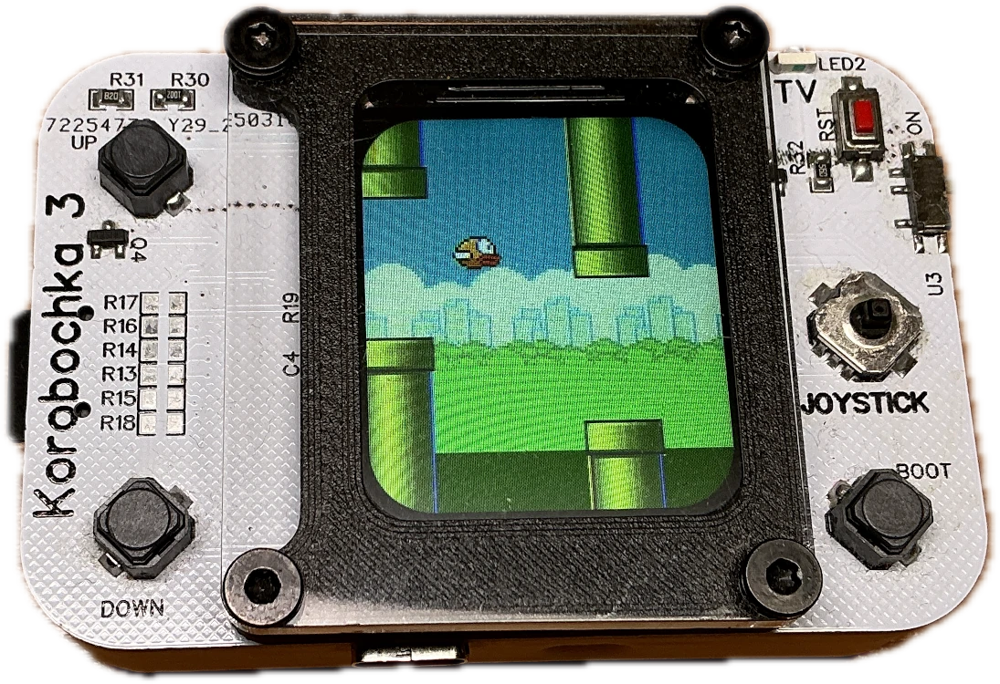
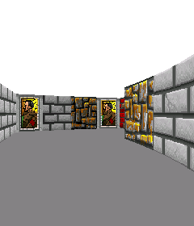
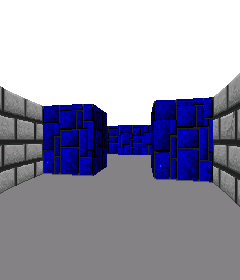
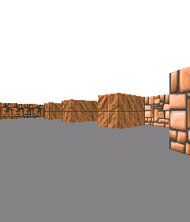

# Korobochka v3
Korobochka v3 это игровая приставка на чипе ESP32-S3



**Характеристики:**

- CPU: 2 ядра Xtensa LX7 @ 240 mHz (32-bit)
- RAM: 512 kB SRAM + 8 MB внешней PSRAM
- ROM: 16 MB
- WiFi 4
- Bluetooth 5.0 (LE)
- Дисплей: IPS 240*280 пикселей (16 бит)
- Аккумулятор: Li-ion 3.7 Wh
- Слот карты памяти: до 10 МБ/с
- USB 2.0 type-C
- ИК-приемник и передатчик
- RTC DS3231 с точностю ±1 мин/год

**Архитектура процессора**

Tensilica Xtensa - не самая известная архитектура микропроцессоров, однако её используют в специализированных микроконтроллерах, например в звуковой периферии Intel, в некоторых беспроводных наушниках. Но самое широкое распространение она получила в микроконтроллерах серии esp, которые используются в 60% устройств умного дома за счет низкой цены и беспроводных интерфейсов.

Xtensa использует 24-битные и 16-битные (narrow) инструкции, что позволяет получить очень высокую плотность кода.

Ядра ESP32-S3 имеют 128-битные регистры, которые можно использовать с векторными интсрукциями. Доступны операции над float через вектоные инструкции или через FPU.

Необычным преимуществом архитектуры является система окна регистров. В момент времени ядру доступны 16 из 64 регистров. При вызове функции (call4/call8/call12) регистровое окно сдвигается, позволяя функции использовать регистры сразу, не сохраняя чужие данные из них в память. При этом регистры предыдущей функции не перезаписываются, а параметры можно передать через часть регистрового окна, принадлежащую вызвавшей функции.

**Схемотехника**

Это уже третья версия, поэтому получилсоь сделать достаточно удобно для использования:

Устройство можно запитать как от USB 5В, так и от аккумулятора. Схема сама выберет, откуда взять напряжение: из USB, чтобы не расходовать ресурс аккумулятора, или от батареи, когда нужна автономная работа. Достигается это при помощи n-канального мосфета, диода и резистора - очень просто и дешево.

При выключенном питании ток потребления составляет 2 мкА - только для счета времени. Батарея не разрядится, если устройство пролежит без включения год.

Дисплей подключен по одноканальной шине SPI с чатотой 80 МГц. Достаточно для обновления картинки из framebuffer в ОЗУ 70 раз в секнду. DMA пока у меня не используется



**Прошивка**

ESP32-S3 программирую с использованием FreeRTOS - легкая операционная система для микроконтроллеров, которая позволяет использовать многопоточность и многоядерность.

В стандартной прошивке я написал графический интерфейс. 

Несколько игр: змейка, doodle jump, flappy bird. 

Утилиты: часы, календарь, настройки, файловый менеджер, просмотр bmp картинок, просмотр видео из bmp картинок c micro SD. 

Локальный мессенджер: можно отправлять по радиосвязи (протокол ESP-NOW) текстовые сообщения на дальность до 500м. Получаают их все, у кого есть такое устройство.

Приложение для копирования ИК-пультов.

До недавнего времени вся прошивка компилировалась как один цельный объект, что стало неудобно когда прошивка стала разрастаться - нужно ждать перезаписи всех 3-4 МБ при каждом изменении программы. Также нельзя было сделать магазин приложений, нельзя делиться программами как исполняемыми файлами.



**Загрузчик .elf**

Для загрузки исполняемого файла (.elf) не получилось найти  библиотеки, поэтому написал загрузчик сам. 

Из-за специфики платформы, исполняемый сегмент (.text) строго должен лежать в памяти IRAM, хотя физически это часть обычной SRAM, по её адресам можно читать и писать исключительно по 4 байта, поэтому её нельзя применить для хранения сегментов данных (.rodata и .data), обращение к char например вызывает исключение loadProhibited/storeProhidited. Из-за этого статической линковкой воспользоваться не получилось. При загрузке нужно выделить буферы в IRAM и в DRAM, загрузить в них сегменты из elf файла, затем указать в symbol table, адреса в памяти, куда загрузились функции, переменные. А затем, при помощи reloc table, свзать программу в памяти.

По именам символов легко найти адрес функции main(), с которой начнется исполнение. 

Исполняемый файл получается очень маленьким от 1 кБ за счет того что тяжелые библиотеки (например для WiFi), операционная система вынесены за его пределы. Проблему подключения внешних функций я пока решил при помощи ссылки на структуру, содержащую адреса внешних функций. Это не лучший вариант. Правильно было бы линковать внешние функции при общем применении reloc table. Адрес на структуру передается как параметр в функцию main при запуске.

```
#include "export.h"

int main(struct exp_os* os) {
	os->printf("Hello, world!\n");

	os->fopen("/sdcard/file.txt", "r");
	...
}
```

Одним из преимуществ загрузки в память является мгновенный запуск при отладке: программа не записывается в энергонезависимую память, затрачивая время и ресурс памяти. Программы запускаются мгновенно командой make deploy, загружаясь прямо в оперативную память по usb. 

**Процесс компиляции исполняемых файлов**

Программы могут состоять из нескольких файлов .c, при помощи make compile, каждый файл .c в папке транслируется в отдельный объектный файл при помощи компилятора xtensa-gcc. 

Затем происходит частичная линковка с флагом --reloc. Связываются все объекты внутри одной секции, но между разными секциями связывание не происходит. Секциям не предназначаются адреса в ОЗУ во время линковки. В отличие от, например, x86 в xtensa гораздо менее развит MMU, он не предназначен для изоляции процессов и создания виртуального адресного пространства для каждого приложения. В xtensa MMU используется для трансляции адресов различных типов памяти например внешней ОЗУ PSRAM и FLASH памяти.

После линковки получаем .elf файл, готовый к загрузке в память ESP32 и исполнению.

**Wolfenstein 3D**

Я пишу копию игры wolfenstein 3D - raycasting игра с клеточной картой 32*32 блока.

Raycasting - способ псевдо-3D отображения карты от лица икрока. Луч сканирует поле зрения вдоль горизонтали, ищет пересечение со стенками. По удалению стенки от игрока выбирается высота (текстурированной) вертикальной полоски, которая отображается на экране.

Raycasting-игра в действительности является двумерной - все игроки, сущности и стены расположены в одной плоскости. По этой причине разработку удобнее начать с плоского отображения (вид сверху).

Необходимо рассчитать 240 точек пересечений лучей со стенами (по ширине экрана). Хотя процессор имеет FPU, оказалось, что такой расчет занимает около 12 мс, что не очень быстро. Поэтому лучше использовать 32-битные fixed-point числа формата Q16.16

Для того чтобы не высчитывать cos и sin несколько тысяч раз за кадр, можно создать таблицу предпосчитанных значений. Для оптимизации также можно дискретизировать угол поворота игрока до 1024 позиций на оборот

Текстуры для стен хранятся в бнарном виде, в файле размером около 1 МБ. Каждая текстура иммет разрешение 64*64 пикс.





Карта - массив из 32*32 байт. Бинарный образ карты имеет размер 1028 байт: карта + цвет потолка и пола. Карты хранятся в виде фалйов